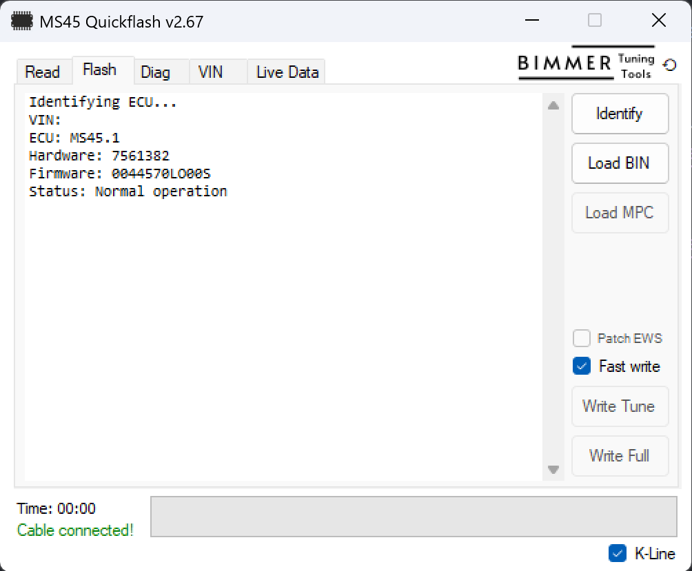
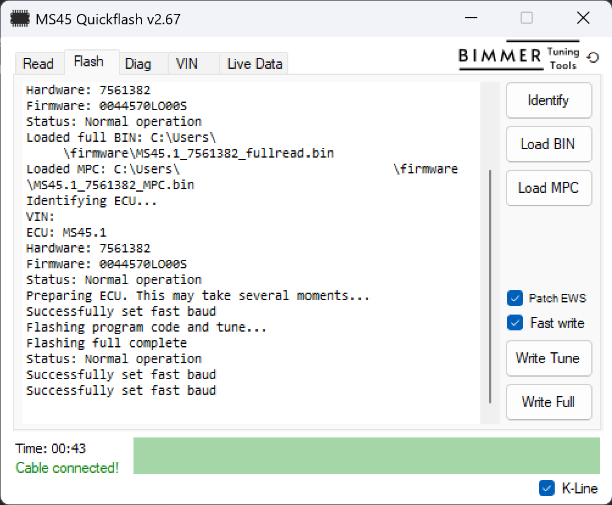

# Immobilizer Delete

The immobilizer or EWS module can be coded out by using [MS45 Quickflash](https://www.bimmertuningtools.com/product/ms45-quickflash/). This will allow the vehicle to start without needing to see a valid RFID key id. Simply do a full read, go to the Flash tab, Identify ECU, upload BIN and MPC, check **Patch EWS** box, and Write Full.

 
