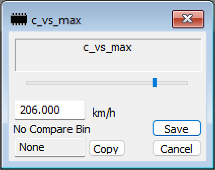
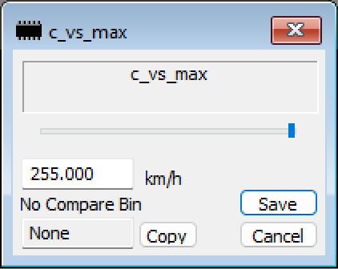

# Vehicle Speed Limiter

The vehicle speed can be limited using the [c_vs_max property](https://www.ms4x.net/index.php?title=Siemens_MS45#Vehicle_Speed_Limiter). From factory this value was set to 206km/hr (128mph). To remove this limit you can set the value to 255.

 
